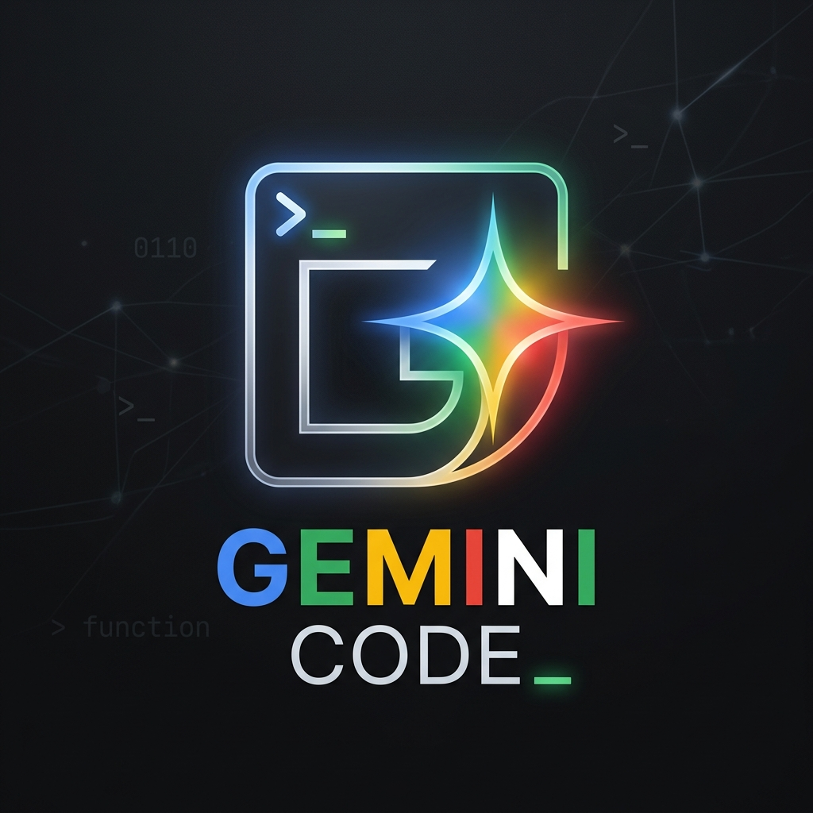

# Gemini Code

**Gemini Code** is a fully capable, terminal-based AI coding assistant and autonomous agent powered by Google DeepMind's Gemini API. It removes the friction of manual operations by intelligently creating, editing, and deleting files, as well as executing terminal commands on your behalf.

> **Version:** 0.1.0
> **Author:** Ahmetenesssssss

## Features

- **Agentic File Operations:** The AI can autonomously create brand new files, edit existing code, or cleanly remove unnecessary files.
- **Terminal Execution:** It can execute command-line requests instantly (e.g., npm installations, building projects, running servers).
- **Project Awareness:** Automatically reads your folder structures to give the AI the contextual awareness it needs to give accurate implementations.
- **Multiple AI Models:** Choose between different Gemini models tailored for your needs, including the latest Gemini Flash and Gemini Pro versions.
- **Sleek Interface:** Colorized, readable CLI design using the official Google Gemini theme colors.

## Getting Started

1. Set up an API Key from Google AI Studio: [https://aistudio.google.com/app/apikey](https://aistudio.google.com/app/apikey)
2. Run the `GeminiCode.exe` executable.
3. Follow the onboarding flow to enter your API key when prompted.
4. Select the project folder you would like to have the terminal assistant navigate.
5. Provide prompts and watch the AI work its magic!

## Usage Examples

You can give it high-level tasks, for example:
- *"Add a simple express server to the current directory."*
- *"Refactor the auth mechanisms in `src/auth.ts`"*
- *"Run tests out of the current codebase."*

The assistant will take control by determining which shell commands and file changes are required, and execute them perfectly on your local machine.

## License & Copyright

All rights strictly reserved.
**Copyright (c) 2026 Ahmetenesssssss.**

This source code and executable are provided for personal educational reference only. You are NOT allowed to use, copy, modify, merge, publish, distribute, sublicense, and/or sell copies of the software in any form or by any means, without the prior explicit written permission of the author.

Any unauthorized copying, theft, modification, or distribution is strictly prohibited and governed by national and international copyright laws.
